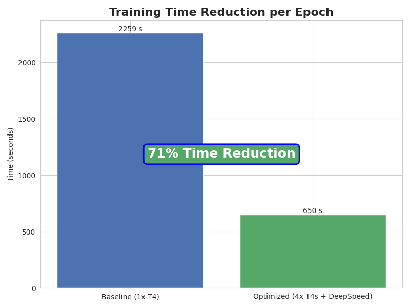

# Accelerating GPT-2 Training on Multi-GPU Systems with DeepSpeed


[](https://opensource.org/licenses/MIT)

This project demonstrates a successful strategy for drastically reducing the training time of a GPT-2 model by scaling from a single GPU to a multi-GPU cluster on **Amazon Web Services (AWS)** using the **DeepSpeed** library.

The primary outcome was a **71% reduction in training time (a 3.5x speedup)**, showcasing a robust and reproducible MLOps workflow for distributed training.

## The Core Achievement: A 71% Reduction in Training Time

By implementing a Data Parallelism strategy with DeepSpeed, the time required to train the model for one epoch was reduced from **~38 minutes to under 11 minutes**.



| Configuration | Training Time | Speedup |
| :--- | :--- | :--- |
| Baseline (1x T4) | ~2259 seconds | 1x |
| **Optimized (4x T4s)** | **~650 seconds** | **~3.5x** |

## The Engineering Challenge

The primary bottleneck in many deep learning projects is the long training time required on a single GPU. This slow feedback loop hinders experimentation, hyperparameter tuning, and model development. The objective of this project was to directly address this challenge by architecting a scalable, distributed training solution.

## Technical Solution & Architecture

The performance gains were achieved through a combination of key technologies:

1.  **PyTorch:** The foundational deep learning framework used for the GPT-2 model implementation.
2.  **DeepSpeed:** A powerful library from Microsoft used to implement a **Data Parallelism** strategy. DeepSpeed handled the complexities of distributing data batches, synchronizing gradients, and managing optimizer states across all four T4 GPUs.
3.  **Amazon Web Services (AWS) EC2:** The experiments were conducted on a `g4dn.12xlarge` instance (4x NVIDIA T4 GPUs) to simulate a common cloud-based production environment.

### An Important Engineering Decision
The initial codebase included a custom Triton-based Flash Attention kernel intended for newer GPU architectures. During testing on the T4 hardware, this kernel failed due to a hardware-software incompatibility. Instead of getting blocked, I made the pragmatic engineering decision to **disable the non-essential custom kernel** and focus on the primary optimization: the multi-GPU distributed framework. This ensured system stability and still delivered massive performance improvements, demonstrating an ability to adapt solutions for real-world hardware constraints.

## How to Reproduce These Results

The results of this project are fully reproducible. The training scripts automatically generate verifiable `training_metrics.json` files, and a separate script consumes these files to generate the chart shown above.

### 1. Setup
```bash
git clone https://github.com/kadamrahul18/GPT2-Optimization.git
cd GPT2-Optimization
pip install -r requirements.txt
```

### 2. Data Preparation
```bash
python scripts/1_download_data.py
python scripts/preprocess_small.py
```

### 3. Run the Single-GPU Baseline
This run will produce `checkpoint/baseline_t4_small/training_metrics.json`.
```bash
export CUDA_VISIBLE_DEVICES=0
time python src/gpt2.py \
    --run_type baseline \
    --train_data_path train_small.bin \
    --val_data_path val_small.bin \
    --checkpoint_path checkpoint/baseline_t4_small \
    --epochs 1 \
    --deepspeed_config src/deepspeed_config.json```

### 4. Run the Multi-GPU Optimized Version
This run will produce `checkpoint/optimized_t4_small/training_metrics.json`.
```bash
unset CUDA_VISIBLE_DEVICES
time deepspeed src/gpt2.py \
    --run_type optimized \
    --train_data_path train_small.bin \
    --val_data_path val_small.bin \
    --checkpoint_path checkpoint/optimized_t4_small \
    --epochs 1 \
    --deepspeed_config src/deepspeed_config.json
```

### 5. Generate the Chart
This command consumes the output of the previous steps to create the final visual.
```bash
pip install matplotlib seaborn
python scripts/3_generate_charts.py \
    --baseline-json checkpoint/baseline_t4_small/training_metrics.json \
    --optimized-json checkpoint/optimized_t4_small/training_metrics.json
```
---
