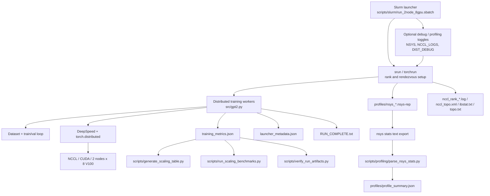

# GPT-2 2-Node Distributed Training, Profiling, and Optimization

This repo contains a small distributed-training harness for GPT-2 on NYU Big Purple. It launches multi-node runs through Slurm, writes structured artifacts per run, supports optional Nsight Systems profiling, and includes a communication-focused DeepSpeed tuning change that improved throughput by about 19.5% under fixed-work conditions.

The point of the project is not just to train GPT-2. It is to make multi-node runs comparable, inspectable, and easier to debug.

## Architecture


```mermaid
flowchart TD
    A[Slurm launcher<br/>scripts/slurm/run_2node_8gpu.sbatch] --> B[srun / torchrun<br/>rank and rendezvous setup]
    B --> C[Distributed training workers<br/>src/gpt2.py]

    C --> D[Dataset + train/val loop]
    C --> E[DeepSpeed + torch.distributed]
    E --> F[NCCL / CUDA / 2 nodes x 8 V100]

    A --> G[Optional debug / profiling toggles<br/>NSYS, NCCL_LOGS, DIST_DEBUG]
    G --> B

    C --> H[training_metrics.json]
    C --> I[launcher_metadata.json]
    C --> J[RUN_COMPLETE.txt]
    B --> K[profiles/nsys_*.nsys-rep]
    B --> L[nccl_rank_*.log / nccl_topo.xml / ibstat.txt / topo.txt]

    K --> M[nsys stats text export]
    M --> N[scripts/profiling/parse_nsys_stats.py]
    N --> O[profiles/profile_summary.json]

    H --> P[scripts/generate_scaling_table.py]
    H --> Q[scripts/run_scaling_benchmarks.py]
    H --> R[scripts/verify_run_artifacts.py]
```

The project has three layers:
- **Orchestration**: Slurm + `srun` + `torchrun` launch the multi-node job and enable profiling/debug modes.
- **Runtime**: `src/gpt2.py` drives the train loop while DeepSpeed, `torch.distributed`, NCCL, and CUDA handle distributed execution.
- **Observability and analysis**: each run emits structured artifacts, and the Python tooling turns raw profiler output into summaries that are easier to compare.

## Environment

Recorded run context:
- Cluster: NYU Big Purple (Slurm)
- Nodes: 2 nodes (examples seen in runs: `gn-0013`, `gn-0014`)
- GPUs: Tesla V100-SXM2-16GB, 4 per node → 8 GPUs total (`world_size=8`)
- Python 3.11.14, PyTorch 2.9.1+cu128, DeepSpeed 0.18.3, Transformers 4.57.3, CUDA 12.8
- Model: GPT‑2 (n_layer=12, n_head=12, n_embd=768), `seq_len=512`
- Precision: fp16 via DeepSpeed, ZeRO stage=1
- Dataset: `train_small` / `val_small` (subset sizes recorded in `training_metrics.json`)

## Quickstart

Prereqs:
- `train_small.bin` / `val_small.bin` present in repo root (see **Data** below).
- Run from the repo root.

### Data (small subset)
```bash
python scripts/1_download_data.py
python scripts/preprocess_small.py
```

### Benchmark run
Use this for throughput numbers. It keeps profiling off and runs a fixed work window.
```bash
RUN_DIR=/gpfs/scratch/$USER/GPT2-Optimization/benchmarks/bigpurple_v100_$(date +%F)/8gpu_2node_accum2_300 \
  NSYS=0 NCCL_LOGS=0 TORCHRUN_LOGS=0 DIST_DEBUG=0 \
  GRAD_ACCUM_STEPS=2 MICRO_BATCH_SIZE_PER_GPU=2 \
  GPT2_EXTRA_ARGS="--profile_mode --max_train_steps 300 --max_val_steps 50" \
  sbatch scripts/slurm/run_2node_8gpu.sbatch
```

Notes:
- `--profile_mode` throttles hot-loop logging/tqdm and adds stable, high-level NVTX ranges (`train/*`, `val/*`) on top of DeepSpeed’s NVTX ranges.
- `--max_train_steps/--max_val_steps` bound the run for quick, repeatable comparisons.
- The exact command line is also recorded under `training_metrics.json["command_line"]`.

### Profiling run
Use this for attribution, not for headline throughput.
```bash
RUN_DIR=/gpfs/scratch/$USER/GPT2-Optimization/benchmarks/bigpurple_v100_$(date +%F)/8gpu_2node_accum2_bucket200_nsys80 \
  NSYS=1 NCCL_LOGS=0 TORCHRUN_LOGS=1 DIST_DEBUG=0 \
  GRAD_ACCUM_STEPS=2 MICRO_BATCH_SIZE_PER_GPU=2 \
  GPT2_EXTRA_ARGS="--profile_mode --max_train_steps 80 --max_val_steps 0" \
  sbatch scripts/slurm/run_2node_8gpu.sbatch
```

## Run Artifacts

Each Slurm run writes a run directory at `RUN_DIR` containing:

- `training_metrics.json` (rank0): schema v2.0 metrics, including tokens/sec, wall time, batch config, Slurm metadata when available.
- `RUN_COMPLETE.txt` (rank0): completion marker including `world_size`, `tokens_per_sec`, and `total_wall_time_sec`.
- `launcher_metadata.json` (rank0): launcher context (host, env summary, Slurm info).
- Checkpoints (e.g. `epoch-1`): large model artifacts; **not meant for git**.

Optional NCCL/debug artifacts (enable with `NCCL_LOGS=1`):
- `nccl_topo.xml`: NCCL topology dump.
- `nccl_rank_<host>_<pid>.log`: per-rank NCCL debug logs (these runs show “Using network IB”).
- `ibstat.txt`, `topo.txt`: network + GPU topology evidence (e.g., `mlx5_0` speed `100000`).

Optional profiling artifacts (enable with `NSYS=1`):
- `profiles/nsys_<jobid>_<host>.nsys-rep`
- `profiles/nsys_<jobid>_<host>.sqlite`
- `profiles/nsys_stats_<host>.txt` (NVTX/OSRT/CUDA API summaries)
- `profiles/profile_summary.json` (parsed top5, generated by `scripts/profiling/parse_nsys_stats.py`)

Checked-in artifacts used in this README live under:
- `artifacts/feature4_bigpurple_v100_2026-01-28/`

## Results

Comparable A/B setup: constant `world_size=8`, `seq_len=512`, `micro_batch=2`, `grad_accum=2`, `max_train_steps=300`, `max_val_steps=50`.

### What changed in `bucket200`
- `src/deepspeed_config.json`: set `zero_optimization.reduce_bucket_size=200000000` and `zero_optimization.allgather_bucket_size=200000000` (≈200MB).
- `src/deepspeed_config.json`: disabled activation checkpoint partitioning (`activation_checkpointing.partition_activations=false`) for this workload.

Minimal config snippet:
```json
{
  "zero_optimization": {
    "stage": 1,
    "reduce_bucket_size": 200000000,
    "allgather_bucket_size": 200000000
  },
  "activation_checkpointing": {
    "partition_activations": false
  }
}
```

### Reproduce the A/B
Run A (baseline, no profiler):
```bash
RUN_DIR=/gpfs/scratch/$USER/GPT2-Optimization/benchmarks/bigpurple_v100_$(date +%F)/8gpu_2node_accum2_300 \
  NSYS=0 NCCL_LOGS=0 TORCHRUN_LOGS=0 DIST_DEBUG=0 \
  GRAD_ACCUM_STEPS=2 MICRO_BATCH_SIZE_PER_GPU=2 \
  GPT2_EXTRA_ARGS="--profile_mode --max_train_steps 300 --max_val_steps 50" \
  sbatch scripts/slurm/run_2node_8gpu.sbatch
```

Run B (tuned “bucket200”, no profiler):
```bash
RUN_DIR=/gpfs/scratch/$USER/GPT2-Optimization/benchmarks/bigpurple_v100_$(date +%F)/8gpu_2node_accum2_bucket200_300 \
  NSYS=0 NCCL_LOGS=0 TORCHRUN_LOGS=0 DIST_DEBUG=0 \
  GRAD_ACCUM_STEPS=2 MICRO_BATCH_SIZE_PER_GPU=2 \
  GPT2_EXTRA_ARGS="--profile_mode --max_train_steps 300 --max_val_steps 50" \
  sbatch scripts/slurm/run_2node_8gpu.sbatch
```

Compare:
- `RUN_DIR/training_metrics.json` → `epochs[0].tokens_per_sec_global`, `epochs[0].step_time_p95_sec`
- `RUN_DIR/training_metrics.json` → `summary.total_wall_time_sec`

### Backing artifacts
The numbers below are backed by checked-in files under:
- `artifacts/feature4_bigpurple_v100_2026-01-28/`

Benchmark runs (`NSYS=0`, 300-step harness):
- Baseline metrics: `artifacts/feature4_bigpurple_v100_2026-01-28/accum2_300/training_metrics.json`
- Tuned metrics: `artifacts/feature4_bigpurple_v100_2026-01-28/bucket200_300/training_metrics.json`

Profiling runs (`NSYS=1`, used for attribution only):
- Baseline `nsys stats`: `artifacts/feature4_bigpurple_v100_2026-01-28/baseline_2026-01-26/nsys_stats_gn-0011.txt`
- Tuned `nsys stats`: `artifacts/feature4_bigpurple_v100_2026-01-28/bucket200_nsys80/nsys_stats_gn-0013.txt`
- Parsed top-5 summary: `artifacts/feature4_bigpurple_v100_2026-01-28/bucket200_nsys80/profile_summary.json`

| Run | run_dir (curated) | Tokens/sec (global) | total_wall_time_sec | step_time_p95_sec | Notes |
| --- | --- | ---: | ---: | ---: | --- |
| Baseline (accum2) | `artifacts/feature4_bigpurple_v100_2026-01-28/accum2_300` | 29,971.23 | 82.96 | 0.07741 | `NSYS=0`, `global_batch=32` |
| Tuned (bucket200) | `artifacts/feature4_bigpurple_v100_2026-01-28/bucket200_300` | 35,806.75 | 71.20 | 0.06317 | `NSYS=0`, ZeRO‑1 bucket sizing |

Throughput improvement:
- `(35,806.75 / 29,971.23 − 1) ≈ +19.5%`

Rigor note:
- The A/B runs above were executed on different commits (`d8ca451` vs `ba03420`). The intended behavioral change for Feature 4 is the DeepSpeed bucket sizing + activation-checkpoint toggle described above; rerunning Run A on the latest commit is recommended for a single-commit apples-to-apples comparison.

Profiling-overhead example:
- `artifacts/feature4_bigpurple_v100_2026-01-28/bucket200_nsys80` reports `tokens_per_sec_global ≈ 24,090.97` with `NSYS=1`.

## Profiling Takeaway

The main profiler takeaway is that training time is dominated by backward and gradient synchronization rather than forward compute.

- Baseline NVTX (Nsight Systems `nvtx_sum`):
  - `:DeepSpeedEngine.backward` **53.9%**
  - `:DeepSpeedEngine.allreduce_gradients` **40.8%**
  - `NCCL:ncclAllReduce` appears with **42,748 instances**
  - Source: `artifacts/feature4_bigpurple_v100_2026-01-28/baseline_2026-01-26/nsys_stats_gn-0011.txt`

- Tuned NVTX (bucket200, `NSYS=1`, 80-step profiling run):
  - `:DeepSpeedEngine.allreduce_gradients` **16.8%**
  - `NCCL:ncclAllReduce` **520 instances**
  - Source: `artifacts/feature4_bigpurple_v100_2026-01-28/bucket200_nsys80/nsys_stats_gn-0013.txt`

The baseline and tuned profiles above come from different capture windows, so they are useful as attribution evidence, not as direct benchmark comparisons.

OS Runtime Summary shows large time in `poll` / `pthread_cond_timedwait` / `sem_wait` / `sem_timedwait`, consistent with distributed waiting and synchronization.

## Profiling Workflow

1) Run a short profiling job (`NSYS=1`) and wait for completion. Artifacts land under `RUN_DIR/profiles/`.
2) Parse the stats into a compact summary:
```bash
python scripts/profiling/parse_nsys_stats.py --run_dir "$RUN_DIR"
cat "$RUN_DIR/profiles/profile_summary.json"
```
3) View raw tables:
```bash
sed -n '/NVTX Range Summary/,/OS Runtime Summary/p' "$RUN_DIR"/profiles/nsys_stats_*.txt
sed -n '/OS Runtime Summary/,/CUDA API Summary/p' "$RUN_DIR"/profiles/nsys_stats_*.txt
```
4) Open `profiles/nsys_<jobid>_<host>.nsys-rep` in the Nsight Systems GUI to inspect the full timeline.

## Repo Structure

- `src/`
  - `src/gpt2.py`: training entrypoint (baseline + DeepSpeed), metrics output, optional profiling-friendly mode.
  - `src/deepspeed_config.json`: DeepSpeed defaults (fp16, ZeRO‑1, bucket sizing).
- `scripts/`
  - `scripts/slurm/run_2node_8gpu.sbatch`: 2-node launcher with optional NSYS/NCCL logs.
  - `scripts/profiling/parse_nsys_stats.py`: parses `nsys_stats_*.txt` → `profiles/profile_summary.json`.
  - `scripts/1_download_data.py`, `scripts/preprocess_small.py`: data pipeline for `train_small.bin`/`val_small.bin`.
- `benchmarks/`: example benchmark outputs (full runs).
- `artifacts/`: curated, small artifacts used to document Feature 4.

## Notes / Caveats

- **Profiling overhead**: `NSYS=1` reduces throughput; use it for attribution only.
- **Comparable runs**: for throughput claims, keep `world_size`, `seq_len`, `micro_batch_size_per_gpu`, `grad_accum_steps`, and step limits identical.
- **Slurm specifics**: always set `RUN_DIR` to a writable scratch path.
- **NCCL logs are expensive**: `NCCL_LOGS=1` produces large per-rank logs and can slow runs.
