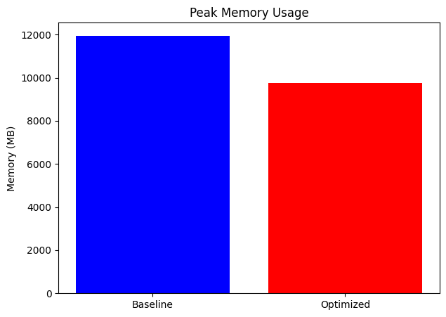

# **GPT-2 Training and Optimization with DeepSpeed**

## **Description of the Project**
This project focuses on training and optimizing a GPT-2 model using PyTorch and DeepSpeed. It includes a baseline implementation using standard PyTorch training loops and an optimized version leveraging DeepSpeed's capabilities for pipeline parallelism, activation checkpointing, and other performance enhancements. The project also incorporates FlashAttention for improved attention mechanism efficiency.

The goal of this project is to reduce training time, memory usage, and inference latency while maintaining the performance of the GPT-2 model, particularly for long-sequence tasks.

---

## **Project Milestones and Completion Status**

1. **Baseline Model Implementation:**  
   - **Status:** Completed  
   - A PyTorch-based implementation of GPT-2 with training and validation routines.

2. **DeepSpeed Integration for Optimized Training:**  
   - **Status:** Completed  
   - Incorporated DeepSpeed features like pipeline parallelism, activation checkpointing, and ZeRO optimization.

3. **FlashAttention Integration:**  
   - **Status:** Completed  
   - Replaced standard attention with FlashAttention to handle long sequences efficiently.

4. **Performance Analysis and Evaluation:**  
   - **Status:** Completed  
   - Detailed performance analysis comparing baseline and optimized implementations.

5. **Documentation and Code Structuring:**  
   - **Status:** Completed  
   - README with setup instructions, usage examples, and results.

---

## **Repository and Code Structure**

- **gpt2.py:** Main script for training and validation of the GPT-2 model (supports both baseline and optimized modes).  
- **preprocess_data.py:** Script for downloading and preprocessing the OpenWebText dataset into binary format.  
- **deepspeed_config.json:** Configuration file for DeepSpeed with parameters for pipeline stages, micro-batch sizes, and activation checkpointing.  
- **checkpoints/**: Directory for storing model checkpoints and performance metrics.  
- **data/**: Directory for storing preprocessed training and validation data (e.g., train.bin, val.bin).  
- **results/**: Directory for storing performance metrics and generated charts.  
- **README.md:** Project documentation.

---

## **Setup Instructions**

### **Prerequisites**
- Python 3.8 or later  
- PyTorch 1.13.1 or later  
- DeepSpeed  
- Transformers library  
- CUDA-enabled GPU (recommended)  
- Other dependencies: `pytest`, `tqdm`, `numpy`, `tiktoken`, `datasets`

### **Data Preparation**
Run the `preprocess_data.py` script to download and preprocess the OpenWebText dataset:
`python preprocess_data.py` This will generate train.bin (~17GB) and val.bin (~8.5MB) in the project directory for training and validation.

`python gpt2.py --run_type baseline --train_data_path train.bin --val_data_path val.bin --checkpoint_path checkpoint --epochs 1 --train_micro_batch_size_per_gpu 4 --gradient_accumulation_steps 4` Run this for baseline Training

`deepspeed gpt2.py --run_type optimized --train_data_path train.bin --val_data_path val.bin --checkpoint_path checkpoint --epochs 1 --deepspeed_config deepspeed_config.json --pipeline_stages 2 --train_micro_batch_size_per_gpu 4 --gradient_accumulation_steps 4` Run this for Optimized Training

After training, the script automatically generates text. Modify the prompt and max_length parameters in gpt2.py to customize text generation.

## **Results and Observations**

### **Results**

| Metric              | Baseline         | Optimized         | Improvement (%) |  
|---------------------|------------------|-------------------|-----------------|  
| Training Time/Epoch | ~16.4 seconds    | ~9.2 seconds      | ~44%            |  
| Validation Loss     | 6.04             | 5.23              | -               |  
| Inference Latency   | ~3.99 seconds    | ~2.62 seconds     | ~34%            |  
| Inference Throughput| ~64 tokens/sec   | ~97 tokens/sec    | ~50%            |  
| Peak Memory Usage   | ~12 GB           | ~9.7 GB           | ~18%            |  

### **Charts**

1. **Training Throughput per Epoch:**  
   

2. **Validation Loss per Epoch:**  
   

3. **Training Time per Epoch:**  
   

4. **Peak Memory Usage:**  
   

### **Observations**
- **Training Time:** Significant reduction (44%) with DeepSpeed and FlashAttention.  
- **Memory Usage:** FlashAttention reduces peak memory usage by ~18%, enabling longer sequences.  
- **Inference Performance:** Throughput improved by 50%, and latency reduced by 34%.  
- **Convergence:** Optimized training achieves faster convergence in early epochs.

---

## **Acknowledgments**
We thank our institution and computing resource providers for their support. This project is based on resources provided by DeepSpeed, Triton, and the PyTorch community.

