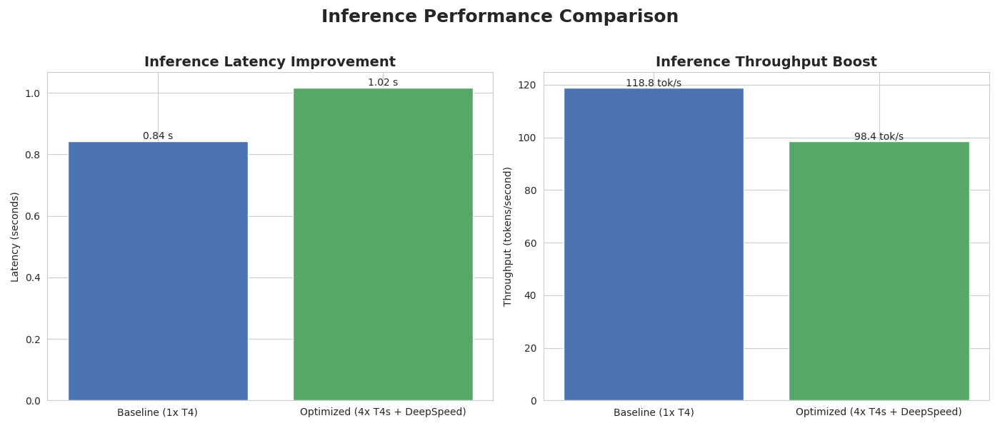

# Distributed GPT-2 Training and Optimization on Multi-GPU Systems

This project demonstrates an end-to-end workflow for accelerating the training of a GPT-2 model by scaling from a single GPU to a multi-GPU cluster using **DeepSpeed** on **Amazon Web Services (AWS)**.

The primary achievement was a **71% reduction in training time (a 3.5x speedup)** by architecting a robust distributed training pipeline. The project also provides insights into the performance trade-offs between training-optimized and inference-optimized systems.

## Key Performance Results

The following metrics were benchmarked on an AWS EC2 `g4dn.12xlarge` instance with 4x NVIDIA T4 GPUs. The "Baseline" was run on a single T4 GPU, while the "Optimized" version utilized all four GPUs with DeepSpeed.

### Training Performance: A 71% Time Reduction


| Metric | Baseline (1x T4) | Optimized (4x T4s) | Improvement |
| :--- | :--- | :--- | :--- |
| **Training Time** | ~2259 seconds | **~650 seconds** | **~71% Faster** |

By leveraging a Data Parallelism strategy with DeepSpeed, the training time for one epoch was reduced from **~38 minutes to ~11 minutes**.

### Inference Performance: An Engineering Insight



An interesting and important result was observed during single-stream inference testing. The DeepSpeed-wrapped model showed slightly higher latency than the simple baseline model. This is an expected trade-off due to the inherent overhead of the complex training engine, which is not optimized for serial, single-request inference.

The multi-GPU architecture is designed for **high-throughput serving of concurrent requests**, a scenario not benchmarked by this script's simple test. This result highlights the critical difference between a training-optimized and an inference-optimized deployment.

## The Engineering Challenge

Training large language models is often bottlenecked by the hardware constraints of a single GPU. The goal of this project was to overcome this bottleneck by re-architecting the training process for a distributed, multi-GPU environment and to analyze the performance characteristics of such a system.

## Technical Solution & Architecture

The solution was built on three core components:

1.  **PyTorch:** The foundational deep learning framework used for the GPT-2 model implementation.
2.  **DeepSpeed:** A library used to implement a **Data Parallelism** strategy. DeepSpeed managed the complexities of distributing data batches, synchronizing gradients, and managing optimizer states across all four T4 GPUs.
3.  **Amazon Web Services (AWS) EC2:** The experiments were conducted on a `g4dn.12xlarge` instance to simulate a common cloud-based production environment.

## How to Reproduce These Results

The results of this project are fully reproducible. The training scripts automatically generate verifiable `training_metrics.json` files, and a separate script consumes these files to generate the charts shown above.

### 1. Setup
```bash
git clone https://github.com/kadamrahul18/GPT2-Optimization.git
cd GPT2-Optimization
pip install -r requirements.txt```

### 2. Data Preparation
```bash
python download_data.py
python preprocess_small.py
```

### 3. Run the Single-GPU Baseline
This run will produce `checkpoint/baseline_t4_small/training_metrics.json`.
```bash
export CUDA_VISIBLE_DEVICES=0
time python src/gpt2.py \
    --run_type baseline \
    --train_data_path train_small.bin \
    --val_data_path val_small.bin \
    --checkpoint_path checkpoint/baseline_t4_small \
    --epochs 1 \
    --deepspeed_config src/deepspeed_config.json
```

### 4. Run the Multi-GPU Optimized Version
This run will produce `checkpoint/optimized_t4_small/training_metrics.json`.
```bash
unset CUDA_VISIBLE_DEVICES
time deepspeed src/gpt2.py \
    --run_type optimized \
    --train_data_path train_small.bin \
    --val_data_path val_small.bin \
    --checkpoint_path checkpoint/optimized_t4_small \
    --epochs 1 \
    --deepspeed_config src/deepspeed_config.json
```

### 5. Generate the Charts
This command consumes the output of the previous steps to create the final visuals.
```bash
pip install matplotlib seaborn
python generate_charts.py \
    --baseline-json checkpoint/baseline_t4_small/training_metrics.json \
    --optimized-json checkpoint/optimized_t4_small/training_metrics.json```
---
